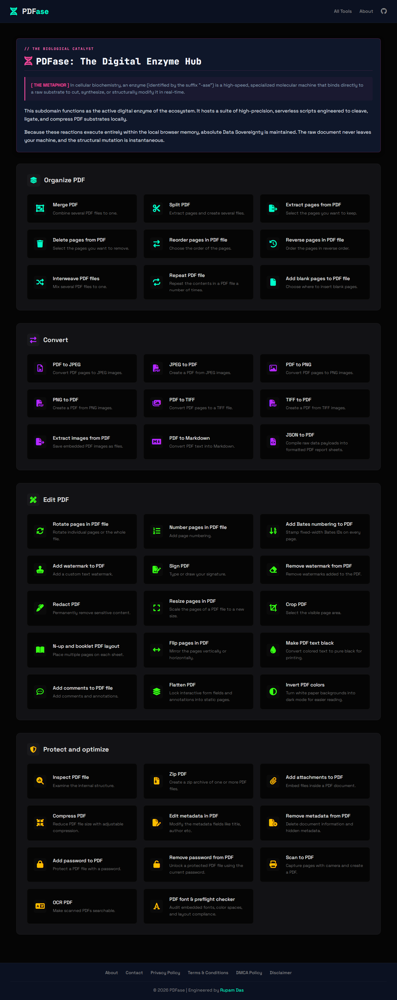

# 🧬 PDFase: The Digital Enzyme Hub

### // THE BIOLOGICAL CATALYST
**[ THE METAPHOR ]** In cellular biochemistry, an enzyme (identified by the suffix "-ase") is a high-speed, specialized molecular machine that binds directly to a raw substrate to cut, synthesize, or structurally modify it in real-time.

This repository functions as the active digital enzyme of the ecosystem. It hosts a suite of high-precision, serverless scripts engineered to cleave, ligate, and compress PDF substrates locally. 

Because these reactions execute entirely within the local browser memory, absolute **Data Sovereignty** is maintained. The raw document never leaves your machine, and the structural mutation is instantaneous.

---

## 🛠️ The Complete Enzyme Catalog (45 Tools)

### 🟦 Organize PDF
* **Merge PDF:** Combine several PDF files to one.
* **Split PDF:** Extract pages and create several files.
* **Extract pages from PDF:** Select the pages you want to keep.
* **Delete pages from PDF:** Select the pages you want to remove.
* **Reorder pages in PDF file:** Choose the order of the pages.
* **Reverse pages in PDF file:** Order the pages in reverse order.
* **Interweave PDF files:** Mix several PDF files to one.
* **Repeat PDF file:** Repeat the contents in a PDF file a number of times.
* **Add blank pages to PDF file:** Choose where to insert blank pages.

### 🟪 Convert
* **PDF to JPEG:** Convert PDF pages to JPEG images.
* **JPEG to PDF:** Create a PDF from JPEG images.
* **PDF to PNG:** Convert PDF pages to PNG images.
* **PNG to PDF:** Create a PDF from PNG images.
* **PDF to TIFF:** Convert PDF pages to a TIFF file.
* **TIFF to PDF:** Create a PDF from TIFF images.
* **Extract images from PDF:** Save embedded PDF images as files.
* **PDF to Markdown:** Convert PDF text into Markdown.
* **JSON to PDF:** Compile raw data payloads into formatted PDF report sheets.

### 🟩 Edit PDF
* **Rotate pages in PDF file:** Rotate individual pages or the whole file.
* **Number pages in PDF file:** Add page numbering.
* **Add Bates numbering to PDF:** Stamp fixed-width Bates IDs on every page.
* **Add watermark to PDF:** Add a custom text watermark.
* **Sign PDF:** Type or draw your signature.
* **Remove watermark from PDF:** Remove watermarks added to the PDF.
* **Redact PDF:** Permanently remove sensitive content.
* **Resize pages in PDF:** Scale the pages of a PDF file to a new size.
* **Crop PDF:** Select the visible page area.
* **N-up and booklet PDF layout:** Place multiple pages on each sheet.
* **Flip pages in PDF:** Mirror the pages vertically or horizontally.
* **Make PDF text black:** Convert colored text to pure black for printing.
* **Add comments to PDF file:** Add comments and annotations.
* **Flatten PDF:** Lock interactive form fields and annotations into static pages.
* **Invert PDF colors:** Turn white paper backgrounds into dark mode for easier reading.

### 🟨 Protect and Optimize
* **Zip PDF:** Create a zip archive of one or more PDF files.
* **Add attachments to PDF:** Embed files inside a PDF document.
* **Compress PDF:** Reduce PDF file size with adjustable compression.
* **PDF metadata viewer:** Read hidden document properties, author details, and creation data.
* **Edit metadata in PDF:** Modify the metadata fields like title, author etc.
* **Remove metadata from PDF:** Delete document information and hidden metadata.
* **Add password to PDF:** Protect a PDF file with a password.
* **Remove password from PDF:** Unlock a protected PDF file using the current password.
* **Scan to PDF:** Capture pages with camera and create a PDF.
* **OCR PDF:** Make scanned PDFs searchable.
* **PDF font & preflight checker:** Audit embedded fonts, color spaces, and layout compliance.
* **Inspect PDF file:** Examine the internal structure.

---

## 🔬 The 3-Day Sprint & AI Architecture

I am an undergraduate Microbiology student, not a formally trained computer scientist. 

This entire ecosystem—comprising about 45 complex, client-side data manipulation tools—was architected and built in an intense **3-day sprint**. 

Instead of getting bogged down in memorizing vanilla JavaScript syntax, API boilerplate, or canvas coordinate math, I leveraged **Google Gemini** as my "junior developer." I defined the structural logic, the biological metaphors, the UI/UX ecosystem, and the strict privacy parameters (zero-server data processing). Gemini acted as my syntax translator, allowing me to build at the speed of thought. 

The scientific method—running a test, observing the output, refining the prompt, and iterating (about 300 commits)—is language-agnostic. This project proves that with modern AI, domain experts can architect complex software tools tailored perfectly to their own industry's needs.

## 🚀 Technical Stack
* **Core Logic:** Vanilla JavaScript (ES6+), HTML5, CSS3.
* **PDF Engine:** [`pdf-lib`](https://pdf-lib.js.org/) for direct structural modification.
* **Rendering Engine:** [`pdf.js`](https://mozilla.github.io/pdf.js/) for high-fidelity canvas visualization.
* **OCR Engine:** [`tesseract.js`](https://tesseract.projectnaptha.com/) for client-side neural network text recognition.

## 💻 Running Locally
Because PDFase is 100% client-side, there is no backend server or Node.js environment to configure.

1. Clone the repository: `git clone https://github.com/d-rupam/pdfase.git`
2. Open the directory.
3. Serve using any local web server (e.g., Python: `python -m http.server 5500` or VS Code Live Server).
4. Navigate to `http://localhost:5500`.

## 📄 License
This project is open-source and available under the [MIT License](LICENSE).

---
*Engineered by [Rupam Das](https://rupamdas.in)*
